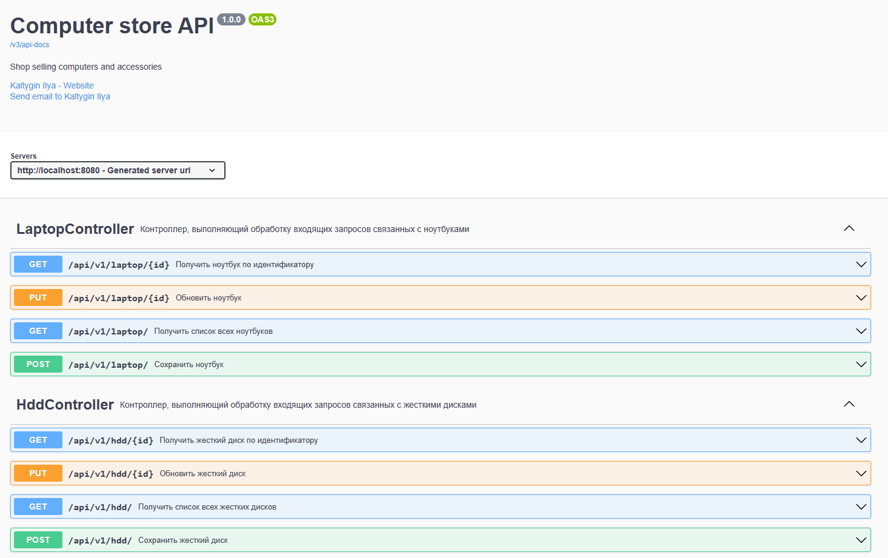
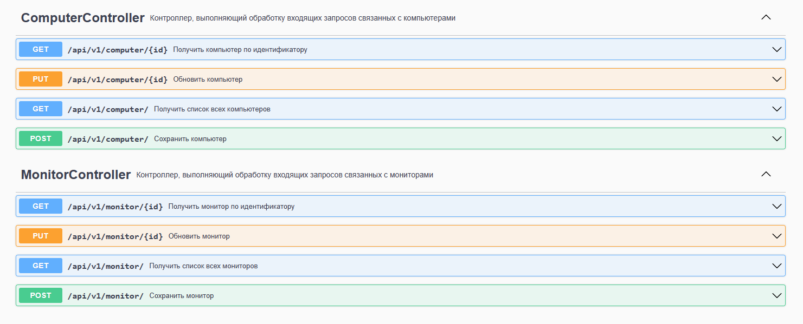
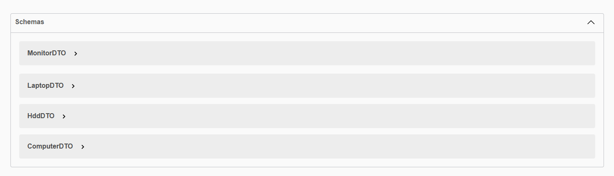

# EasyBot

# Описание проекта:
* REST сервис - магазин, торгующий компьютерами и коплектующими.
* Реализованы HTTP методы выполняющие:
  - Добавление товара.
  - Редактирование товара.
  - Просмотр всех существующих товаров по типу.
  - Просмотр товара по идентификатору.

# Стек технологий:
* Java 17
* Spring Boot 2.7.12
* Spring Data JPA 2.7.12
* Liquibase 3.6.2
* Lombok 1.18.26
* H2DB 2.1.214
* Apache Maven 3.8.5
* Checkstyle-plugin 3.1.2
* Swagger 2.2.8

# Требования к окружению:
* Java 17
* Maven 3.8.5

# Запуск проекта с помощью терминала:
1. Запустить проект
```shell
mvn spring-boot run
```
2. Для выполнения запросов использовать Swagger или другой API
```shell
http://localhost:8080/swagger-ui.html
```

# Запуск проекта с помощью docker-compose:
1. Клонируйте проект
```shell
gi clone https://github.com/Ilya96s/easybot
```
2. Перейдите в папку проекта
```shell
cd easybot
```
3. Создайте образ проекта
```shell
docker-compose build
```
4. Выполните команду
```shell
docker-compose up
```

# Взаимодействие с приложением:





# Контакты
### Telegram: @Ilya96s

